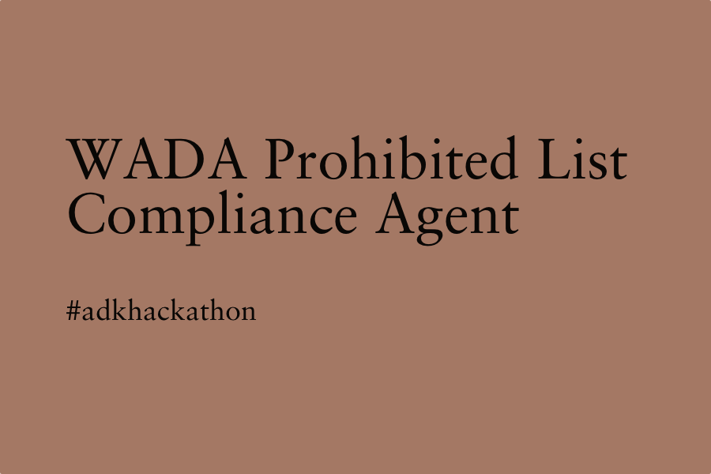
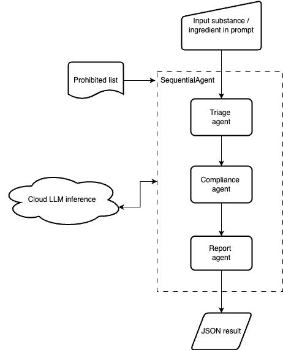
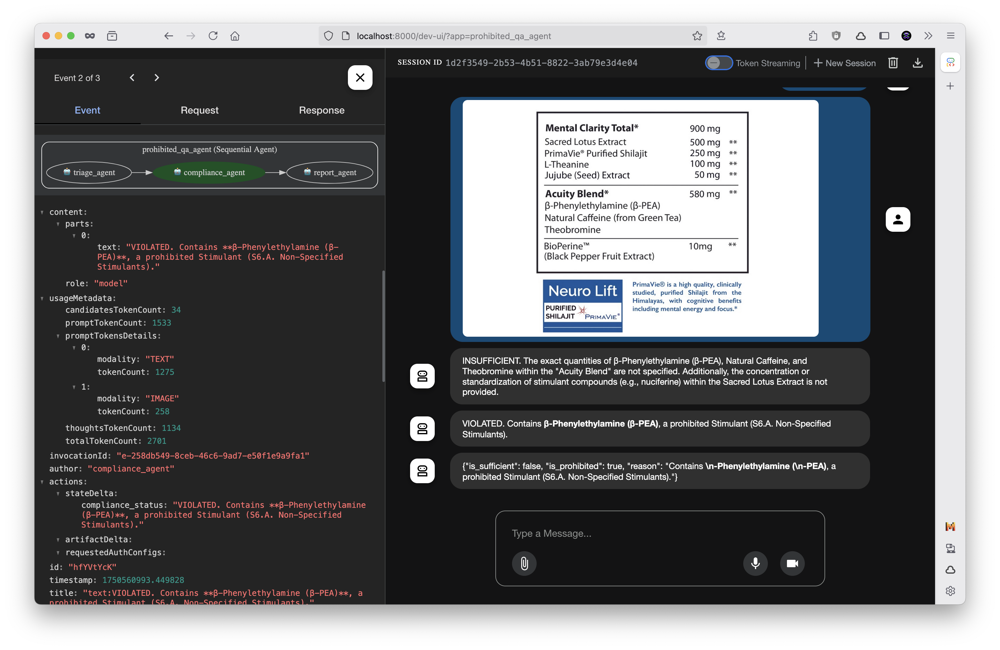

# WADA Prohibited List Compliance Agent

## Summary

An AI agent designed to ensure that professional athletes' sports supplements comply with the World Anti-Doping Agency (WADA) regulations, thereby preventing inadvertent doping from commercially available sports supplement products.

This submission is for the **Google Agent Development Kit Hackathon** with Google Cloud 2025, under the **Automation of Complex Processes** category.

## About

Professional athletes bear sole responsibility for any prohibited substances detected within their systems. While the World Anti-Doping Agency (WADA) maintains a comprehensive list, its intricate chemical nomenclature presents challenges, rendering manual compliance checks for supplements cumbersome and susceptible to errors.

This AI agent automates the verification process for off-the-shelf sports supplement products, facilitating accurate and efficient adherence to anti-doping regulations.

## AI Agent Architecture

This AI agent has been developed utilising the Google Agent Development Kit (ADK), incorporating a multi-agent architecture. The system employs a sequential agent workflow to manage state transitions, comprising specialised components:



*   **Triage Agent**: Responsible for the initial processing and validation of user input, ensuring data quality prior to further analysis.
*   **Compliance Agent**: The core component of the system, this agent meticulously validates supplement substances against the WADA Prohibited List to identify any potential violations.
*   **Report Agent**: Responsible for generating a structured output in JSON format, suitable for integration with downstream systems or analytical tools. **Pydantic** has been employed to enforce strict data schemas, thereby ensuring the accuracy and integrity of all structured outputs.

This modular, agent-based design ensures scalability, maintainability, and precise control over each stage of the compliance-checking process.

## Usage



https://github.com/user-attachments/assets/697c06d4-24d2-4e29-b1f5-f7078d1b5b1e

1.  **Install Dependencies and Configure API Keys**:
    ```bash
    uv sync
    cp .env.example .env
    ```
    *(Ensure your API key secrets are entered into the `.env` file.)*

2.  **Launch the Development User Interface**:
    ```bash
    adk web
    ```

3.  **Initiate a Query**:
    Input the ingredients of the supplement in the prompt.

4.  **AI Agent Responses**:

    *   **State Examples**:

        ```
        INSUFFICIENT. The individual concentrations for β-Phenylethylamine, Caffeine, and Theobromine within the "Acuity Blend" are not specified; only the total for the blend is provided. Furthermore, the serving size and recommended daily dosage are absent, both of which are necessary to ascertain the total daily intake of the ingredients.

        VIOLATED. Contains **β-Phenylethylamine (β-PEA)**, a prohibited non-Specified Stimulant (S6.a).
        ```

    *   **JSON Structured Output Example**:
        The AI agent provides a response that includes a JSON object detailing the result and the reasoning:

        ```json
        {
          "is_sufficient": false,
          "is_prohibited": true,
          "reason": "Contains β-Phenylethylamine (β-PEA), a prohibited non-Specified Stimulant (S6.a)."
        }
        ```
